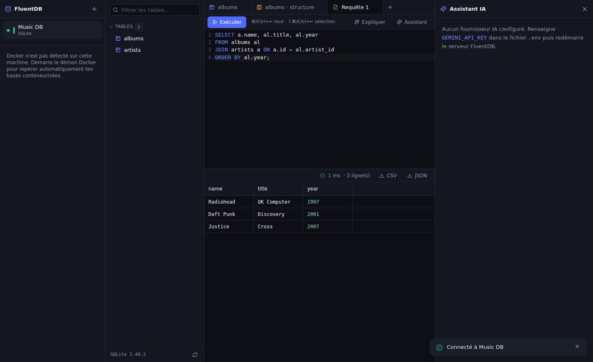

# FluentDB

Un logiciel moderne de gestion de bases de données — une alternative « au goût du jour » à
TablePlus / pgAdmin / DBeaver — avec un **assistant IA intégré**, conscient du schéma.

FluentDB tourne en local : un petit serveur Node que tu lances chez toi, avec une interface
web soignée en mode sombre. Il parle **PostgreSQL**, **MySQL / MariaDB** et **SQLite**, détecte
automatiquement les bases lancées dans **Docker**, et embarque un assistant IA (Google Gemini,
Ollama à venir) qui génère, explique et corrige du SQL en langage naturel.



## Fonctionnalités

- **Gestion des connexions** — plusieurs connexions enregistrées, identifiants chiffrés en local,
  test de connexion, couleur par connexion (rouge pour la prod, à la TablePlus), mode lecture seule.
- **Détection Docker** — repère les conteneurs `postgres` / `mysql` / `mariadb`, lit leurs ports
  publiés et leurs variables d'environnement pour pré-remplir la connexion en un clic.
- **Explorateur de schéma** — arbre des bases, schémas, tables, vues, colonnes, index et clés étrangères.
- **Grille de données** — pagination, tri et filtres côté serveur, **édition inline** des cellules,
  insertion et suppression de lignes, barre de changements en attente (tout est envoyé en une transaction).
- **Édition de structure** — ajout / modification / suppression de colonnes et d'index via l'interface,
  avec **aperçu du SQL avant application**.
- **Éditeur SQL** — CodeMirror 6, coloration syntaxique, **autocomplétion consciente du schéma**,
  onglets multiples, exécution de la requête ou de la sélection (⌘/Ctrl+↵), historique des requêtes.
- **Export** — résultats en CSV ou JSON.
- **Assistant IA** — chat contextuel, génération de SQL en langage naturel, explication et
  optimisation de requêtes. Les suggestions SQL apparaissent en cartes avec **Insérer & exécuter**.

## Démarrage rapide

Prérequis : Node.js ≥ 20.

```bash
npm install
cp .env.example .env      # renseigne GEMINI_API_KEY pour activer l'assistant IA

# Développement (serveur + UI avec rechargement à chaud)
npm run dev
# → serveur sur http://127.0.0.1:4983, UI Vite sur http://localhost:5173

# Production (build de l'UI + serveur qui la sert lui-même)
npm run build
npm start
# → tout est servi sur http://127.0.0.1:4983
```

### Configuration (`.env`)

| Variable            | Rôle                                                         | Défaut                  |
| ------------------- | ------------------------------------------------------------ | ----------------------- |
| `FLUENTDB_PORT`     | Port du serveur local                                        | `4983`                  |
| `FLUENTDB_DATA_DIR` | Dossier des connexions et de l'historique                    | `~/.fluentdb`           |
| `FLUENTDB_SECRET`   | Clé de chiffrement (hex, 32 octets) — sinon générée dans le dossier de données | —          |
| `GEMINI_API_KEY`    | Clé API Google Gemini pour l'assistant IA                    | —                       |
| `GEMINI_MODEL`      | Modèle Gemini                                                | `gemini-2.5-flash`      |
| `DOCKER_HOST`       | Surcharge du socket Docker                                   | `/var/run/docker.sock`  |

## Architecture

Monorepo npm workspaces :

- **`packages/shared`** — types TypeScript + schémas Zod partagés entre serveur et UI (typage bout en bout).
- **`apps/server`** — API Fastify. Cœur : une abstraction **driver** (`src/drivers/`) que chaque moteur
  implémente (introspection normalisée, requêtes/mutations paramétrées, génération de DDL par dialecte,
  annulation de requête). Ajouter un moteur = un dossier de driver.
- **`apps/web`** — UI React + Vite + Tailwind, CodeMirror 6, TanStack Table/Query, Zustand.

L'assistant IA est derrière une interface `AiProvider` : Gemini aujourd'hui, Ollama demain sans toucher
au reste. **La couche IA n'a aucun accès aux drivers** — le SQL qu'elle propose n'atteint la base que
par un clic de l'utilisateur.

## Sécurité

- Le serveur n'écoute **que sur `127.0.0.1`** (l'exposer sur le réseau demande un flag explicite).
- **Protection anti DNS-rebinding** : les requêtes dont l'en-tête `Host` n'est pas local sont rejetées.
- Les identifiants sont **chiffrés en AES-256-GCM** dans `~/.fluentdb/connections.json.enc` ; ils ne sont
  jamais renvoyés par l'API. Modèle de menace : protège contre la copie du fichier / les sauvegardes,
  pas contre un attaquant disposant déjà de ton compte utilisateur (comme TablePlus).
- Les modifications de la grille et les filtres passent **toujours par des requêtes paramétrées** ;
  les identifiants sont validés contre le catalogue introspecté. Le SQL libre de l'éditeur est brut —
  c'est le produit.
- Le schéma envoyé à l'IA ne contient **que la structure**, jamais les données des lignes.

## Tests

```bash
npm test            # tests unitaires + API (vitest, fixture SQLite)
npm run e2e         # parcours navigateur (Playwright)

# Tests d'intégration moteur (auto-ignorés si les variables sont absentes) :
TEST_PG_URL=postgres://user:pw@127.0.0.1:5432/db npx vitest run --project integration
```

## Documentation

Toute la documentation est dans [`docs/`](docs/README.md) :

- [Plan projet](docs/PLAN.md) — vision, décisions, jalons, feuille de route.
- [Architecture](docs/ARCHITECTURE.md) — structure du code et choix techniques.
- [Documentation technique](docs/TECHNICAL.md) — installation, API HTTP, extension.
- [Documentation fonctionnelle](docs/FUNCTIONAL.md) — le produit vu par l'utilisateur.
- [Présentation](docs/PRESENTATION.md) — présentation orientée client.

Voir aussi [`CONTRIBUTING.md`](CONTRIBUTING.md) (conventions de commits, PR,
changelog) et [`CHANGELOG.md`](CHANGELOG.md).

## Licence

MIT
